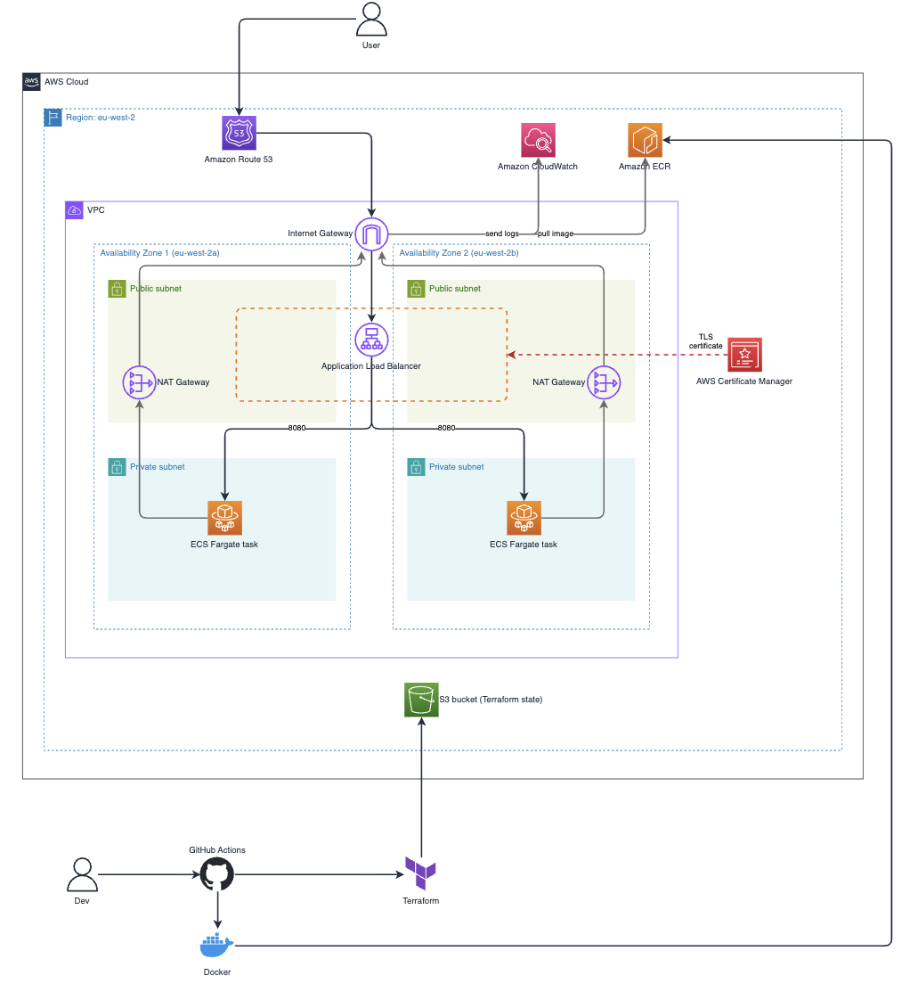

# Threat Composer on AWS ECS Fargate 

## Description

A production-style deployment of AWS Threat Composer, a threat modelling tool, running as a
container on Amazon ECS Fargate behind an Application Load Balancer and served over HTTPS 
on a custom domain.

The infrastructure is built with modular Terraform and managed through three GitHub Actions
pipelines: one to build and publish the container image, one to plan and apply 
infrastructure changes, and one to tear everything down on demand. The build and deploy 
pipelines includes security scanning. Authentication is processed via OIDC, which issues 
short-lived credentials for each run, so no long-lived access keys are ever stored 
in GitHub.

## Architecture diagram


## Repository structure 
```text
.
├── .github
│   └── workflows
│       ├── destroy.yml
│       ├── image.yml
│       └── infra.yml
├── app/
├── images/
├── infra
│   ├── modules
│   │   ├── acm/
│   │   ├── alb/
│   │   ├── ecr/
│   │   ├── ecs/
│   │   ├── route53/
│   │   └── vpc/
│   ├── .terraform.lock.hcl
│   ├── main.tf
│   ├── provider.tf
│   ├── terraform.tfvars
│   └── variables.tf
├── .dockerignore
├── .gitignore
├── .trivyignore
├── Dockerfile
└── README.md
```